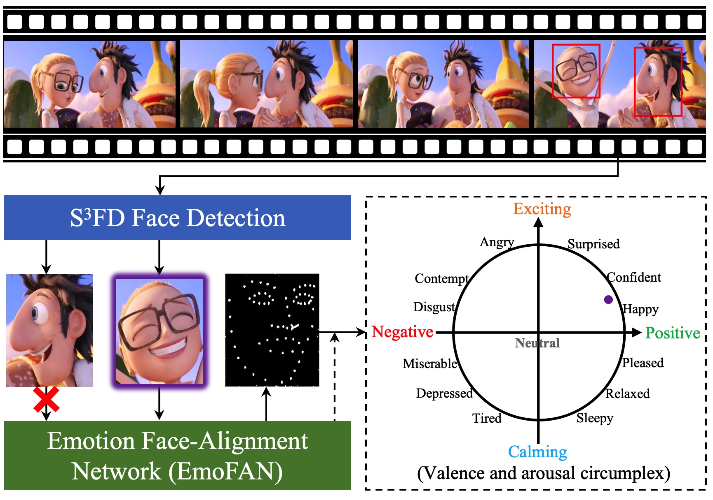

# HPMDubbing - PyTorch Implementation

This is a PyTorch implementation of [**Learning to Dub Movies via Hierarchical Prosody Models**].


# Dependencies
You can install the Python dependencies with
```
pip3 install -r requirements.txt
```

# Dataset
V2C-MovieAnimation is a multi-speaker dataset for animation movie dubbing. It is collected from 26 Disney cartoon movies and covers 153 diverse characters.
The link of raw data can be found from [here](https://pan.baidu.com/s/1wbmd4HnpDsLjTn0YbwwASA), password: eewv

In our work, we release the [V2C-MovieAnimation2.0](https://pan.baidu.com/s/1wbmd4HnpDsLjTn0YbwwASA), password: ectr. To satisfy the requirement of dubbing the specified characters, we removed redundant character faces in movie frames.
 (Please note that our video frames are sampled at 25 FPS by ffmpeg.)


# Data Preparation

## For voice preprocessing (mel-spectrograms, pitch, and energy), we first use the  MFA to obtain the alignments between the duration and the phoneme sequences.

### Download the official MFA package and run
```
./montreal-forced-aligner/bin/mfa_align /data/conggaoxiang/V2C_Data/wav16 /data/conggaoxiang/Style_speech/StyleSpeech/lexicon/librispeech-lexicon.txt  english /data/conggaoxiang/V2C/V2C_Code/example_V2C16/TextGrid -j
```
### then, please run the below script to save the .npy files of mel-spectrograms, pitch, and energy from two datasets, respectively.
```
python V2C_preprocess.py config/MovieAnimation/preprocess.yaml
```
```
python Chem_preprocess.py config/MovieAnimation/preprocess.yaml
```

# Training

Train train.py file with
```
python train.py -p config/MovieAnimation/preprocess.yaml -m config/MovieAnimation/model.yaml -t config/MovieAnimation/train.yaml -p2 config/MovieAnimation/preprocess.yaml
```

# Inferrence
```
python Inference.py --restore_step [Chekpoint] -p config/MovieAnimation/preprocess.yaml -m config/MovieAnimation/model.yaml -t config/MovieAnimation/train.yaml -p2 config/MovieAnimation/preprocess.yaml
```


# Tensorboard
Use
```
tensorboard --logdir output/log/MovieAnimation
```
to serve TensorBoard on your localhost.
The loss curves, mcd curves, synthesized mel-spectrograms, and audios are shown.


# References
- [V2C: Visual Voice Cloning](https://openaccess.thecvf.com/content/CVPR2022/papers/Chen_V2C_Visual_Voice_Cloning_CVPR_2022_paper.pdf), Q. Chen, *et al*.
- [Neural Dubber: Dubbing for Videos According to Scripts](https://proceedings.neurips.cc/paper/2021/file/8a9c8ac001d3ef9e4ce39b1177295e03-Paper.pdf), C. Hu, *et al*.
- [FastSpeech 2: Fast and High-Quality End-to-End Text to Speech](https://arxiv.org/abs/2006.04558), Y. Ren, *et al*.

# Citation
