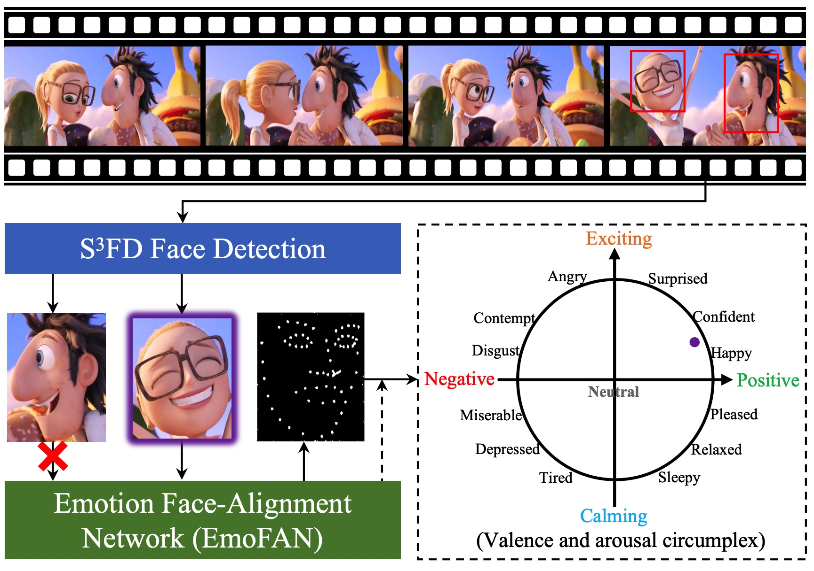

# HPMDubbing🎬 - PyTorch Implementation

In this [paper](), we propose a novel movie dubbing architecture via hierarchical prosody modeling, which bridges the visual information to corresponding speech prosody from three aspects: lip, face, and scene. Specifically, we align lip movement to the speech duration, and convey facial expression to speech energy and pitch via attention mechanism based on valence and arousal representations inspired by the psychology findings. Moreover, we design an emotion booster to capture the atmosphere from global video scenes. All these embeddings are used together to generate mel-spectrogram, which is then converted into speech waves by an existing vocoder. Extensive experimental results on the V2C and Chem benchmark datasets demonstrate the favourable performance of the proposed method.

**Recent Updates**
--------
[11/11/2023]
Uploading the feature of chemistry lecture (Chem) dataset, the sample rating is 160000Hz. 

[18/11/2023]
Uploading pre-trained model and complementing missing details to ensure inference successfully. 

[25/11/2023]
[An explanation about the challenge with the V2C-Animation dataset](https://github.com/GalaxyCong/More-Details-about-the-V2C-Animation-dataset.). 

[3/12/2023]
We plan to share the image areas of the mouth and face we extracted for readers to use conveniently. 


Before [8/7/2023]
Release the GRID dataset (extracted feature and split list for train and test). 

Before [15/7/2023]
Publish the source codes and model of [StyleDubber](https://github.com/GalaxyCong/StyleDubber).  


| Dataset | Frames (25 FPS)   | Face image   | Mouth  image |
|---------|-------------------|--------------|--------------|
| Chem    | [BaiduDrive](https://pan.baidu.com/s/1sTuJCvzDFNAkALXrX4pYtA) (fram)          | [GoogleDrive](https://drive.google.com/drive/folders/16KI32oRMZ3_ft1SiqpJyPmOeJFL20m7c?usp=drive_link), [BaiduDrive](https://pan.baidu.com/s/12NUguAYawXfKkcnCL4x3Bg) (face)   | [GoogleDrive](https://drive.google.com/drive/folders/1d9rQjM7L7sfmTorrgnsNHe6Z1qiYT4yz?usp=drive_link), [BaiduDrive](https://pan.baidu.com/s/1hb17aeVh34InpRiuvQO7sQ) (mout)     |
| V2C 2.0     | Download*          | [BaiduDrive](https://pan.baidu.com/s/1MCFbghFOybm1ENVcAh4x8g) (Ours)     | [BaiduDrive](https://pan.baidu.com/s/1MCFbghFOybm1ENVcAh4x8g) (Ours) |

I'm sorry due to the [copyright issues](https://github.com/chenqi008/V2C/issues/1), V2C frame will not be made public for now.

[10/12/2023]
Uploading [more details](https://github.com/GalaxyCong/HPMDubbing-how-to-get-face-and-lip-) about the data preprocess and script codes.

____________________________
🌟 Below is the generated result of our method on Chem dataset: 


https://github.com/GalaxyCong/HPMDubbing/assets/109259667/9f44a23f-9758-417f-b53e-f65faa667348

📝Text: so the reaction quotient is actually just a reaction product, the product of the two ions.   


https://github.com/GalaxyCong/HPMDubbing/assets/109259667/084475a6-4f1b-489b-9bd2-c00ffd9244b7

📝Text: now, there's also nitrogen in the flask, but it doesn't matter.


https://github.com/GalaxyCong/HPMDubbing/assets/109259667/734ec739-1cf3-428f-8d95-53aeacc9f9c7

📝Text: so we can make that easy connection between a wave and its length by the color that we see.   

https://github.com/GalaxyCong/HPMDubbing/assets/109259667/bf16d48f-b470-4a7a-90bf-a3d251d87019

📝Text: each gas will exert what's called a partial pressure.

____________________________
🌟 Below is the generated result of our method on V2C dataset: 

🌟 Here, we also provide the resulting demo by [V2C-Net](https://github.com/chenqi008/V2C) for comparison. This result is reproduced by the official code of V2C-Net correctly. 


https://github.com/GalaxyCong/HPMDubbing/assets/109259667/48801714-43e9-44f2-bb6a-0e088ab01e0b


📝Text: hey, are you okay?   

🎬Source: TinkerII@Terence


https://github.com/GalaxyCong/HPMDubbing/assets/109259667/b888e15d-1a5a-4222-aff4-34b5c8b5eac6


📝Text: i'm fishing!   

🎬Source: CloudyII@Flint


https://github.com/GalaxyCong/HPMDubbing/assets/109259667/51e1fe35-54fd-4e7f-af3b-a5cb2b2461be


📝Text: well, thank you.   

🎬Source: Ralph@Vanellope


https://github.com/GalaxyCong/HPMDubbing/assets/109259667/fe1ae0fd-7e59-4644-90d7-6b89e91dd285


📝Text: Yes. I'm the baby Jesus.   

🎬Source: Bossbaby@BossBaby


# Dependencies
You can install the Python dependencies with
```
pip3 install -r requirements.txt
```

# Dataset
## 1) For V2C
[V2C-MovieAnimation](https://github.com/chenqi008/V2C) is a multi-speaker dataset for animation movie dubbing with identity and emotion annotations. It is collected from 26 Disney cartoon movies and covers 153 diverse characters. Due to the copyright, we can not directly provide the dataset, [see V2C issue](https://github.com/chenqi008/V2C/issues/1).

In this work, we release the [V2C-MovieAnimation2.0](https://pan.baidu.com/s/151ljJuY72bkntxxgEIUTkQ) to satisfy the requirement of dubbing the specified characters. 
Specifically, we removed redundant character faces in movie frames (please note that our video frames are sampled at 25 FPS by ffmpeg). 
You can download our preprocessed features directly through the link 
[GoogleDrive](https://drive.google.com/drive/folders/1AB-E682_OYhFSBz-y1t36A45e9l1ssRd?usp=share_link) or [BaiduDrive](https://pan.baidu.com/s/1ucVl116YcEBvlZopd9W5mw) (password: Good).


## 2) For Chem
The Chem dataset is provided by [Neural Dubber](https://tsinghua-mars-lab.github.io/NeuralDubber/), which belongs to the single-speaker chemistry lecture dataset from [Lip2Wav](https://github.com/Rudrabha/Lip2Wav). 

In this work, we provide our feature of the Chem dataset, you can download it [BaiduDrive](https://pan.baidu.com/s/1Ml4zwxVIbQGR7yUYpXMGpw) (password: chem) / [GoogleDrive](https://drive.google.com/file/d/1e05XqQh1Va2ToT1z6RDp6dIM2lubLnqk/view?usp=drive_link). To ensure the speech content is guided by the video information like lip movement, in our preprocess, we found some clips that solely contained PowerPoint slides without the presence of an instructor's face, so we removed them further. 
Please note that a [16kHz vocoder](https://github.com/GalaxyCong/HPMDubbing_Vocoder) is used to generate waveforms for Chem.


# Data Preparation

For voice preprocessing (mel-spectrograms, pitch, and energy), Montreal Forced Aligner (MFA) is used to obtain the alignments between the utterances and the phoneme sequences. Alternatively, you can skip the below-complicated step, and use our extracted features, directly.

Download the official [Montreal Forced Aligner](https://montreal-forced-aligner.readthedocs.io/en/latest/) (MFA) package and run
```
./montreal-forced-aligner/bin/mfa_align /data/conggaoxiang/HPMDubbing/V2C_Data/wav16 /data/conggaoxiang/HPMDubbing/lexicon/librispeech-lexicon.txt  english /data/conggaoxiang/HPMDubbing/V2C_Code/example_V2C16/TextGrid -j
```
then, please run the below script to save the .npy files of mel-spectrograms, pitch, and energy from two datasets, respectively.
```
python V2C_preprocess.py config/MovieAnimation/preprocess.yaml
```
```
python Chem_preprocess.py config/MovieAnimation/preprocess.yaml
```
For hierarchical visual feature preprocessing (lip, face, and scenes), we detect and crop the face from the video frames using $S^3FD$ [face detection model](https://github.com/yxlijun/S3FD.pytorch). Then, we align faces to generate 68 landmarks and bounding boxes (./landmarks and ./boxes). Finally, we get the mouth ROIs from all video clips, following [EyeLipCropper](https://github.com/zhliuworks/EyeLipCropper). Similarly, you can also skip the complex steps below and directly use the features we extracted.

We use the pre-trained weights of [emonet](https://github.com/face-analysis/emonet) to extract affective display features, and fine-tune Arousal and Valence (dimension256) according to the last layer of emonet network.
```
python V2C_emotion.py -c emonet_8.pth -o /data/conggaoxiang/V2C_feature/example_V2C_framelevel/MovieAnimation/VA_feature -i /data/conggaoxiang/detect_face 
```
The lip feature is extracted by [resnet18_mstcn_video](https://github.com/mpc001/Lipreading_using_Temporal_Convolutional_Networks), which inputs the grayscale mouth ROIs for each video.
```
python lip_main.py --modality video --config-path /data/conggaoxiang/lip/Lipreading_using_Temporal_Convolutional_Networks-master/configs/lrw_resnet18_mstcn.json --model-path /data/conggaoxiang/lip/Lipreading_using_Temporal_Convolutional_Networks-master/models/lrw_resnet18_mstcn_video.pth --data-dir /data/conggaoxiang/lip/Lipreading_using_Temporal_Convolutional_Networks-master/MOUTH_processing --annonation-direc /data/conggaoxiang/lip/LRW_dataset/lipread_mp4 --test
```
Finally, the scenes feature is provided by V2C-Net from [I3D model](https://github.com/piergiaj/pytorch-i3d).
```
python ./emotion_encoder/video_features/emotion_encoder.py
```

# Vocoder
We provide the pre-trained model and implementation details of [HPMDubbing_Vocoder](https://github.com/GalaxyCong/HPMDubbing_Vocoder). Please download the vocoder of HPMDubbing and put it into the `vocoder/HiFi_GAN_16/` or `/vocoder/HiFi_GAN_220/` folder.
Before running, remember to check line 63 of `model.yaml` and change it to your own path. 
```
vocoder:
  model: [HiFi_GAN_16] or [HiFi_GAN_220]
  speaker: "LJSpeech" 
  vocoder_checkpoint_path: [Your path]
```

# Training

For V2C-MovieAnimation dataset, please run train.py file with
```
python train.py -p config/MovieAnimation/preprocess.yaml -m config/MovieAnimation/model.yaml -t config/MovieAnimation/train.yaml -p2 config/MovieAnimation/preprocess.yaml
```
For Chem dataset, please run train.py file with
```
python train.py -p config/Chem/preprocess.yaml -m config/Chem/model.yaml -t config/Chem/train.yaml -p2 config/Chem/preprocess.yaml
```


# Pretrained models
In this work, we will provide pre-trained models (including parameters of networks and optimizer) and training log files of two dubbing datasets, V2C and Chem, to help you complete the inference. 


| Dubbing Dataset                  | Pre-trained model                                                                                           | Vocoder                                                                  | Training log                                                                 |
|----------------------------------|-------------------------------------------------------------------------------------------------------------|--------------------------------------------------------------------------|------------------------------------------------------------------------------|
| Chem (chemistry lecture dataset) | Download: [GoogleDrive](https://drive.google.com/file/d/1YCH2orTDmoKnTG8a5aaMQRv_QLjVTv-_/view?usp=drive_link) or [BaiduDrive](https://pan.baidu.com/s/1RgNav9b65Rz2iy-JBPxFnw) (password: q44c)     | 16KHz [More Details](https://github.com/GalaxyCong/HPMDubbing_Vocoder)   | [Download](https://pan.baidu.com/s/1Vgw9vxoGj9TDDyyZBrk6kw) (831c)           |
| V2C (V2C-Animation Dataset)      | Download: [GoogleDrive](https://drive.google.com/file/d/1EayaUNVHR21L3zAwG4X5WdVkoB5Fgjn0/view?usp=drive_link) or [BaiduDrive](https://pan.baidu.com/s/1b-aE9C31un3iMAP1T9kLxQ) (password: dxyv)                                                            | 22KHz [More Details](https://github.com/GalaxyCong/HPMDubbing_Vocoder)   | [Download](https://pan.baidu.com/s/1KCXKB2cubmMI_5AzRNFjtA) (phxe)                                                                     |


```
python Synthesis.py --restore_step [Chekpoint] -p config/MovieAnimation/preprocess.yaml -m config/MovieAnimation/model.yaml -t config/MovieAnimation/train.yaml -p2 config/MovieAnimation/preprocess.yaml
```


# Tensorboard
Use
```
tensorboard --logdir output/log/MovieAnimation --port= [Your port]
```
or 
```
tensorboard --logdir output/log/Chem --port= [Your port]
```
to serve TensorBoard on your localhost.
The loss curves, mcd curves, synthesized mel-spectrograms, and audios are shown.


# Some Q&A

Q&A: Why is the Synchronization_coefficient set 4, can I change it using another positive integer? 
     Follow the Formula: n = \frac{T_{mel}}{T_v}=\frac{sr/hs}{FPS} \in \mathbb{N}^{+}.
     e.g., in our paper, for chem dataset, we set the sr == 16000Hz, hs == 160, win == 640, FPS == 25, so n is 4.
                        for chem dataset, we set the sr == 22050Hz, hs == 220, win == 880, FPS == 25, so n is 4.009. (This is the meaning of the approximately equal sign in the article). 

Q&A: Why the use the different sr for two datasets?
     Because, we need to keep the same the expriment setting with original paper. 
     Specifically, for Chem dataset ===> [NeuralDubber](https://tsinghua-mars-lab.github.io/NeuralDubber/) used the 16000Hz in their expriment. 
     for V2C dataset (chenqi et.al) ====> [V2C-Net](https://github.com/chenqi008/V2C) used the 22050Hz as their result. 
     Next step, we have a plan to provide the V2C dataset (16kHz, 24KHz) Version, or Chem dataset (22050Hz, 24KHz) version.

Q&A: Why did you provide two specialized Vocoders? Can I use the official HiFiGAN pre-trained model to replace them?
     In official HiFiGAN, sr is 22050Hz, hop_size is 256, win_size is 1024. 
     So undering this setting, we suggest to use our Vocoder to satify above Formula. 
     We have released our pre-train model (HPM_Chem, HPM_V2C), you can download [it](https://github.com/GalaxyCong/HPMDubbing_Vocoder). 
.....

# Acknowledgement
- [V2C: Visual Voice Cloning](https://openaccess.thecvf.com/content/CVPR2022/papers/Chen_V2C_Visual_Voice_Cloning_CVPR_2022_paper.pdf), Q. Chen, *et al*.
- [Neural Dubber: Dubbing for Videos According to Scripts](https://proceedings.neurips.cc/paper/2021/file/8a9c8ac001d3ef9e4ce39b1177295e03-Paper.pdf), C. Hu, *et al*.
- [FastSpeech 2: Fast and High-Quality End-to-End Text to Speech](https://arxiv.org/abs/2006.04558), Y. Ren, *et al*.

# Citation
<!-- If you find our work useful in your research, please consider citing: -->
If our research and this repository are helpful to your work, please cite with:
```
@inproceedings{cong2023learning,
  title={Learning to Dub Movies via Hierarchical Prosody Models},
  author={Cong, Gaoxiang and Li, Liang and Qi, Yuankai and Zha, Zheng-Jun and Wu, Qi and Wang, Wenyu and Jiang, Bin and Yang, Ming-Hsuan and Huang, Qingming},
  booktitle={Proceedings of the IEEE/CVF Conference on Computer Vision and Pattern Recognition},
  pages={14687--14697},
  year={2023}
}
```
